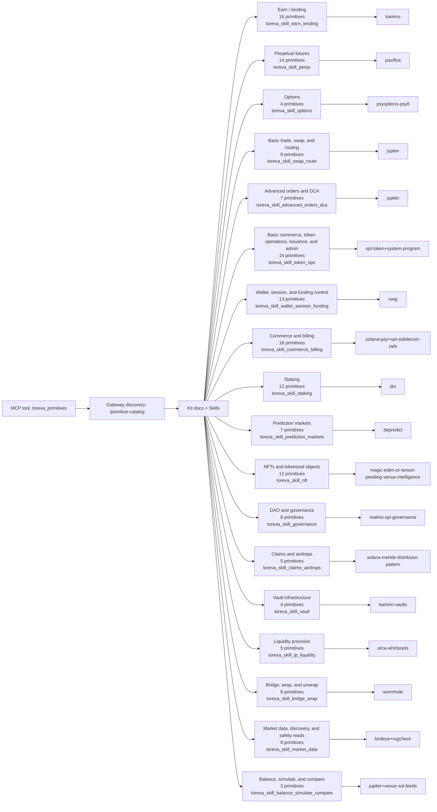

# Solana Primitive Catalog Schematic

> Generated from Gateway primitive metadata. This schematic is discovery and taxonomy, not operational evidence.

## Counts

- Executable/supporting primitive entries: `168`
- Families: `18`
- Composition vocabulary terms: `45`

## Claim Boundary

This is the full planning/discovery universe. It is not an operational or battle-tested claim; check readiness, greenState, and publicExecutable per primitive. Composition layers are vocabulary controls, not standalone execution proof.

